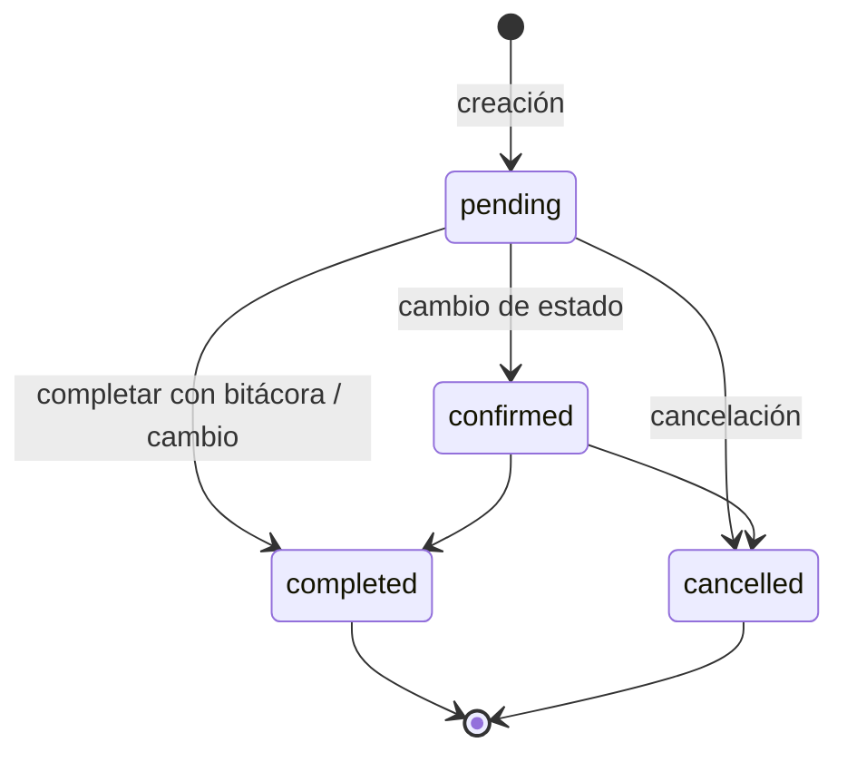

# Diagramas de Agendamiento y Notificaciones – Veterinalia Appointment

Este documento resume visualmente los flujos reales de creación y gestión de citas, y los disparadores de notificaciones implementados en el plugin.

## Estados De Cita


## Flujo: Cliente (Wizard)
```mermaid
flowchart TD
    A[Cliente: Wizard frontend] --> B[Selecciona servicio y fecha/hora]
    B --> C[AJAX get_available_slots]
    C --> D{Slot disponible?}
    D -->|No| B
    D -->|Sí| E[Completa datos cliente/mascota]
    E --> F[AJAX create_appointment]
    F --> G[handle_client_booking]
    G --> H[book_appointment]
    H --> I[Validar servicio + disponibilidad]
    I -->|Error| X[Mensaje error] --> B
    I -->|OK| J[Insertar va_appointments (status=pending)]
    J --> K[Mailer: email a cliente]
    J --> L[Mailer: email a profesional]
    J --> M{Cliente nuevo?}
    M -->|Sí| N[Mailer: invitación reclamar expediente]
    M -->|No| O[Fin]
    K --> O
    L --> O
    N --> O
```

## Flujo: Agenda (Staff)
```mermaid
flowchart TD
    A[Profesional: Agenda UI] --> B[AJAX va_add_appointment]
    B --> C[create_appointment_from_agenda]
    C --> D[Validar: profesional/servicio/cliente/mascota]
    D --> E[check_time_slot_availability]
    E -->|Ocupado| X[Error: horario no disponible]
    E -->|Libre| F[Insertar va_appointments (status=pending)]
    F --> G[Mailer: send_appointment_confirmation]
    G --> H[Email a cliente + profesional]
    H --> I[Fin]
```

## Cambio De Estado
```mermaid
flowchart TD
    A[UI Agenda (AJAX) o REST] --> B{Nuevo estado}
    B -->|confirmed| C[update_appointment_status]
    B -->|cancelled| C
    B -->|completed| C
    C --> D[Actualizar en BD]
    D --> E[Mailer: email al cliente]
    D --> F[Mailer: email al profesional]
    F --> G[Fin]
    E --> G
```

## Completar Con Bitácora
```mermaid
flowchart TD
    A[REST pet-logs + appointment_id] --> B[create_pet_log]
    B -->|OK| C[update_appointment_status('completed')]
    B -->|Error| X[Error: no se guardó historial]
    C --> D[Mailer: emails 'completed']
    D --> E[Fin]
```

## Motor De Notificaciones
```mermaid
flowchart LR
    subgraph Triggers
    T1[Nueva cita (wizard)]
    T2[Nueva cita (agenda)]
    T3[Estado: confirmed/cancelled/completed]
    T4[Cliente invitado]
    end
    subgraph Mailer
    M1[send_new_appointment_email_to_client]
    M2[send_new_appointment_email_to_professional]
    M3[send_appointment_status_email_to_client]
    M4[send_appointment_status_email_to_professional]
    M5[send_claim_invitation_email]
    end
    T1 --> M1 & M2
    T2 --> M1 & M2
    T3 --> M3 & M4
    T4 --> M5
```

---

Notas rápidas
- Estados válidos: pending, confirmed, cancelled, completed.
- Canales activos: Email (wp_mail). No hay SMS/WhatsApp/Push ni recordatorios automáticos.
- Disponibilidad: bloquea solapamientos con estados pending y confirmed.

